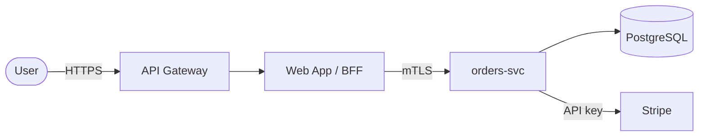

# Security Architecture — [System Name]

> **Purpose of this document.** A factual, descriptive map of how this system is built
> and what security mechanisms it relies on. It describes the *as-is* design and the
> controls that exist — it does **not** assess them, rate them, or list vulnerabilities.
> Findings, gaps, and risk ratings belong in a separate review (e.g. threat model,
> ASVS verification, code review). Mark anything unknown as **UNKNOWN** rather than
> guessing — gaps in knowledge are themselves useful signal for a later review.

**Date**: YYYY-MM-DD
**Author**: Claude Code (agent-security-playbook)
**Sources reviewed**: [repos, IaC, config, docs, interviews]
**System version / commit**: [tag or SHA the description reflects]

---

## 1. System Overview

**What the system does**: [1–3 sentences of business purpose and primary users.]

**Deployment context**: [public internet / internal / partner-facing / air-gapped] ·
[production / staging] · [single-tenant / multi-tenant]

**Component inventory**:

| Component | Role | Language / Framework | Exposure | Source |
|-----------|------|----------------------|----------|--------|
| api-gateway | Edge ingress, TLS termination | nginx | Internet-facing | infra/nginx/ |
| web-app | UI + BFF | TypeScript / Next.js | Internet-facing | apps/web/ |
| orders-svc | Core domain service | Go | Internal only | services/orders/ |
| postgres | Primary datastore | PostgreSQL 16 | Internal only | infra/rds.tf |
| ... | ... | ... | ... | ... |

**Technology & platform stack**: [runtimes, datastores, message brokers, caches, cloud provider, key managed services.]

### 1.1 Architecture Diagram

---

## 2. Trust Boundaries & Data Flow

**Trust boundaries** (where the level of trust in data/callers changes):

| # | Boundary | Crossing from → to | What crosses | Controls at the boundary |
|---|----------|--------------------|--------------|--------------------------|
| B1 | Internet edge | Anonymous user → Gateway | HTTP requests | TLS, WAF, rate limit |
| B2 | App → data tier | web-app → orders-svc | Authenticated calls | mTLS, network policy |
| B3 | Service → third party | orders-svc → Stripe | Payment data | Outbound API key, TLS |
| ... | ... | ... | ... | ... |

**Entry points (attack surface inventory — descriptive)**: [public endpoints, admin
interfaces, webhooks, message-queue consumers, scheduled jobs, CLI/SSH, debug ports.]

**Data flow notes**: [trace how sensitive data enters, where it is processed, where it
is stored, and where it leaves. A `mermaid` data-flow diagram may go here.]

---

## 3. Identity & Access

### 3.1 Authentication — Inbound

> List **every** inbound mechanism — there is usually more than one (end-user login,
> service-to-service, webhooks, admin, machine/CI). Find them all.

| Mechanism | Used by | Protocol / Standard | Credential type | Verification point | Source |
|-----------|---------|---------------------|-----------------|--------------------|--------|
| End-user login | Web users | OIDC (Auth0) | JWT (RS256) access token | gateway + web-app middleware | apps/web/auth.ts |
| Service-to-service | orders-svc ← web-app | mTLS | Client certificate | service mesh | infra/mesh/ |
| Webhook | Stripe → orders-svc | HMAC signature | Shared secret | orders-svc handler | services/orders/webhook.go |
| ... | ... | ... | ... | ... | ... |

For each: token format, signing algorithm, issuer/audience, lifetime, refresh model,
MFA, where credentials are validated.

### 3.2 Authentication — Outbound

> Credentials *this* system presents to others. Often overlooked.

| Target | Mechanism | Credential | Storage | Source |
|--------|-----------|------------|---------|--------|
| Stripe | API key (Bearer) | Secret key | AWS Secrets Manager | services/orders/ |
| Internal DB | Password / IAM auth | Rotated secret | Secrets Manager | infra/rds.tf |
| ... | ... | ... | ... | ... |

### 3.3 Authorization

**Model**: [RBAC / ABAC / ReBAC / ACL / policy-as-code / ad-hoc]

**Enforcement point(s)**: [gateway / middleware / per-handler / DB row-level security / policy engine like OPA/Cedar.]

**Roles / attributes / policies**:

| Role / Attribute | Granted to | Permits | Defined in |
|------------------|-----------|---------|------------|
| admin | Staff | All write ops | policies/rbac.yaml |
| customer | End users | Own resources only | services/orders/authz.go |
| ... | ... | ... | ... |

**Ownership / tenancy checks**: [how the system scopes a request to the caller's own
data or tenant — e.g. `WHERE tenant_id = :caller`, row-level security, claim-derived scoping.]

### 3.4 Session Management

[Stateful vs stateless; cookie attributes (HttpOnly/Secure/SameSite); session store;
idle/absolute timeout; logout/revocation; token refresh and rotation.]

### 3.5 Secrets & Credential Management

[Where secrets live (vault/secrets manager/KMS/env), how they are injected at runtime,
rotation cadence, who/what can read them. Note if any are in source/config — descriptively.]

---

## 4. Data Protection

**Data classification / inventory**:

| Data category | Sensitivity | Where stored | Where it flows |
|---------------|-------------|--------------|----------------|
| Credentials | Secret | Secrets Manager | runtime only |
| PII (name, email) | Confidential | postgres.users | web-app, analytics |
| Payment data | Regulated (PCI) | Stripe (not stored locally) | orders-svc → Stripe |
| ... | ... | ... | ... |

**Encryption in transit**: [TLS versions, where terminated, internal mTLS, cipher policy.]

**Encryption at rest**: [DB/volume/bucket/backup encryption, KMS keys, who manages them.]

**Cryptography & key management**: [algorithms in use for signing/hashing/encryption,
password hashing (e.g. argon2id), key storage, rotation, and HSM/KMS usage.]

---

## 5. Input & Output Handling

**Input validation**: [where inputs are validated, schema/type validation libraries,
canonicalization, allow-list vs deny-list approach, parameterized queries / ORM use.]

**Output handling & encoding**: [templating auto-escaping, content-type handling,
response shaping / DTO projection, CSP and other response headers.]

**Serialization / deserialization**: [formats accepted (JSON/XML/protobuf), parsers used,
any native deserialization, size/depth limits.]

**File & upload handling**: [accepted types, storage location, scanning, path handling.]

---

## 6. Logging, Monitoring & Auditing

[What security-relevant events are logged (authn, authz decisions, admin actions);
log destination and retention; audit-trail integrity; what is deliberately redacted
(secrets/PII); alerting/monitoring stack; correlation IDs.]

---

## 7. Infrastructure & Deployment

**Hosting / cloud**: [provider, regions, account/project layout.]

**Network architecture**: [VPC/subnets, public vs private, segmentation, security
groups / network policies, egress controls, ingress paths, service mesh.]

**Infrastructure as Code**: [Terraform/CloudFormation/Pulumi/Helm — where it lives, what it provisions.]

**Compute & runtime**: [containers/serverless/VMs, orchestration (k8s/ECS), base images,
runtime isolation, privilege/capabilities.]

**CI/CD & build**: [pipeline, where it runs, deployment trigger, artifact signing,
environment promotion, who can deploy.]

**Infra secrets & identity**: [workload identity (IRSA/managed identity/service accounts),
how compute authenticates to cloud services.]

---

## 8. Dependencies & Supply Chain

[Direct dependency footprint and how it is managed (lockfiles, pinning); base images;
SBOM availability; private vs public registries; dependency update mechanism. Descriptive
inventory only — CVE analysis belongs in `sca-audit`.]

---

## 9. External Integrations

| Service | Direction | Purpose | Data shared | Auth | Trust assumption |
|---------|-----------|---------|-------------|------|------------------|
| Stripe | Outbound + webhook | Payments | Payment/PII | API key / HMAC | Trusted processor |
| Auth0 | Outbound | Identity | Auth tokens | OIDC client | Trusted IdP |
| ... | ... | ... | ... | ... | ... |

---

## 10. Tenancy & Isolation

[Single- vs multi-tenant; isolation model (separate DB / schema / row-level / namespace);
where the tenant identifier originates and how it is enforced on every request; shared
infrastructure boundaries.]

---

## 11. AI / Agent-Specific Security

> Include only if the system embeds LLMs, agents, or MCP tooling. Otherwise mark **N/A**.

[Models and providers used; system vs user prompt boundaries; tools/functions the agent
can call and their privileges; how untrusted content reaches the model; human-in-the-loop
points; output handling of model responses; MCP servers and their scopes. See the
`ai-security-skills` plugin for assessment of these — this section only *describes* them.]

---

## 12. Security Controls Summary

A flat inventory of the defensive mechanisms present, for quick reference. (Presence only,
no effectiveness rating.)

| Control | Present? | Where / How | Source |
|---------|----------|-------------|--------|
| TLS in transit | Yes | Gateway + mesh mTLS | infra/ |
| WAF | Yes | AWS WAF | infra/waf.tf |
| Rate limiting | Yes | Gateway | nginx.conf |
| Authentication | Yes | OIDC | §3.1 |
| Authorization | Yes | RBAC + OPA | §3.3 |
| Encryption at rest | Yes | KMS | §4 |
| Audit logging | Partial | authn only | §6 |
| Secrets management | Yes | Secrets Manager | §3.5 |
| Input validation | UNKNOWN | — | — |
| ... | ... | ... | ... |

---

## 13. Assumptions & Open Questions

- [Stated trust assumptions — e.g. "internal network is considered trusted".]
- [Anything marked UNKNOWN above that a later review should resolve.]
- [Areas the source material did not cover.]

---

## Appendix: ASVS Chapter Cross-Reference

Optional. Maps described mechanisms to the OWASP ASVS v5.0 chapter that governs them, to
hand off to a later verification pass. See `data/asvs/`.

| Topic in this doc | ASVS chapter |
|-------------------|--------------|
| Authentication (§3.1–3.2) | V6 Authentication |
| Session management (§3.4) | V7 Session Management |
| Authorization (§3.3) | V8 Authorization |
| Input/output handling (§5) | V2 Validation & Encoding |
| Cryptography (§4) | V11 Cryptography |
| Logging (§6) | V16 Logging |
| Data protection (§4) | V14 Data Protection |
| Infrastructure (§7) | V12 / V13 Config & API |
